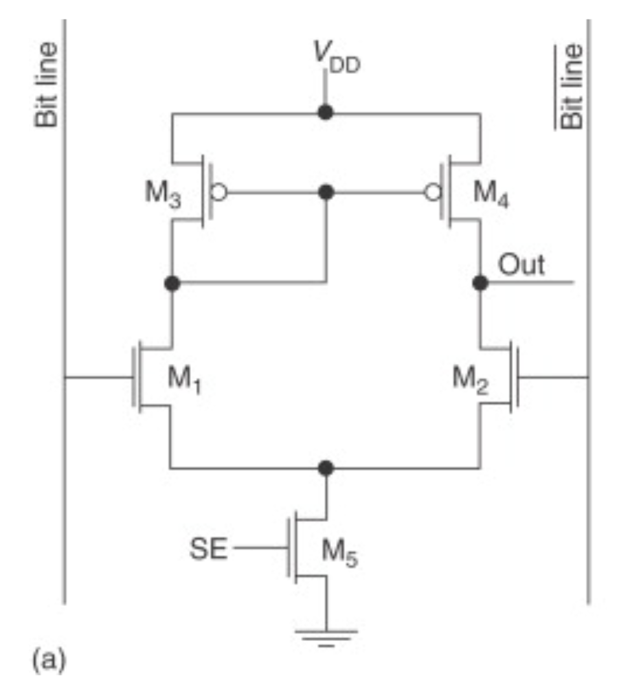

## Design Document

### Circuit Design
This is a continuous-time differential amplifier for sensing RAM bitlines. It take a tiny voltage difference on the bitlines (around 100mV) and amplify it to a full-scale signal (0-1.8V) that the rest of the system can use. Our initial design was using the latched sense amp but then we went with continuous-time operation because our architecture needs to monitor the bitline voltage throughout the read cycle, not just capture it at one clock edge.

The circuit has three parts:

**Difference Amplifier**: 

The amplifier is implemented using two NMOS and two PMOS transistors. It operates by converting a small differential voltage input on the bitlines into a current imbalance between the two branches (around a 2× difference in the current through the two NMOS). This current imbalance charges and discharges the internal parasitic capacitances, producing a larger voltage separation at the output. Compared to other amplifier circuits, this design has the advantages of faster speed and lower power consumption because it allows a quick reading of the differential signal on the bit lines.

**Current mirror**: It keeps the sum of the current across the two NMOS fixed and keeps them in saturation so they have decent gain and don't drift around when the common-mode voltage changes.

**Output buffers**: It is implemented by two CMOS inverters that take the amplified signal and drive it to full scaled analog output. It also isolates the high-impedance differential stage from whatever capacitive load comes next.

### Circuit Operation: 
**Input Stage - Differential Pair**
M2 and M1 are the NMOS input transistors. Their gates connect to the two bitlines (Vin1 and Vin2). The sources tie together and connect to the current mirror (M5-M6), which provides a fixed tail current (i.e. 40μA). This 40μA has to split between M1 and M2. How it splits depends on the gate voltages. If Vin1 = Vin2 (no differential input), the current splits evenly - 20μA through each transistor. But if Vin1 > Vin2, then M2 conducts more current and M1 conducts less. The total is still 40μA.

If Vin1 goes up by 100mV relative to Vin2, M2's gate voltage is higher, so Vgs becomes higher and increases the current across M2. However, since the tail current is fixed, the increase in current across M2 results in a decrease in current across M1 by the same amount. Say M2 now takes 30μA and M1 only gets 10μA. That 10μA difference (compared to the balanced 20μA-20μA state) is what we're going to amplify.

When M1 current decreases (from 20μA to 10μA), M3 current also decreases since they're in series - whatever current M1 pulls down, M3 has to supply from VDD. With less current through the diode-connected M3, VG34 voltage rises (PMOS needs lower Vgs to conduct less current, so if current drops, gate voltage must rise relative to source at VDD).

Here's the feedback: VG34 controls both M3 and M4. When VG34 rises, M4's Vgs becomes smaller (gate closer to VDD), so M4 also conducts less current. M4 drops from 20μA to maybe 10μA.

Now look at the Vinv node where M2 and M4 meet:
- M2 wants to pull 30μA down to ground (increased from 20μA)
- M4 can only supply 10μA from VDD (decreased from 20μA)

There's a 20μA mismatch. M4 can't keep up with M2's demand, so Vinv voltage has to drop. The node voltage adjusts until the currents balance again through the transistor characteristics.

M1 and M2 are the NMOS input transistors. Their gates connect to the two bitlines (Vin1 and Vin2). The sources tie together and connect to the current mirror (M5-M6), which provides a fixed tail current (i.e. 40μA). This 40μA has to split between M1 and M2. How it splits depends on the gate voltages. If Vin1 = Vin2 (no differential input), the current splits evenly - 20μA through each transistor. But if Vin1 > Vin2, then M2 conducts more current and M1 conducts less. The total is still 40μA.
If Vin1 goes up by 100mV relative to Vin2. M2's gate voltage is higher, so Vgs becomes higher and increases the current across M2.

However, since the tail current is fixed, the increasing in current across M2 results a decreasing in current across in M1 with the same amount.

M3 and M4 are PMOS transistors with their gates tied together at the VG34 node. M3's drain connects to M1's drain, and M4's drain connects to M2's drain. But here's the trick - M3 is also diode-connected (gate tied to drain), so it sets the voltage at VG34.

When M1 current decreases (from 20μA to 15μA), M3 current also decreases since they're in series. M3 being diode-connected means VG34 rises when less current flows through it.

Now here's where the feedback kicks in: VG34 is the gate voltage for both M3 AND M4. When VG34 rises, M4 also conducts less current. But remember M4 is connected to M2, and M2 is trying to conduct MORE current (25μA instead of 20μA).

At the Vinv node (M2 drain and M4 drain connection), you've got:
- M2 trying to pull 25μA down to ground
- M4 only able to supply 15μA from VDD

There's a 10μA mismatch. M4 can't keep up with M2's demand. This current imbalance forces the Vinv voltage to drop.

#### Iteration 1
Got the design proposal done by Oct 8 and created a rough circuit in LTSpice. At this point it was just the basic differential pair with two NMOS inputs and PMOS loads. The simulation showed it could amplify the voltage difference a little bit, but the numbers were all over the place depending on what values we picked for the length and width for the transistors. Gain was anywhere from 5dB to 20dB just from changing transistor widths randomly. Clearly needed to be more systematic about sizing.

#### Iteration 2
Spent the next few weeks (up to Oct 29) figuring out transistor dimensions. Started with minimum sizes and worked up from there. Tried a bunch of W/L ratios for the input pair. We noticed that wider transistors gave better bandwidth but ate more current. For the PMOS loads, we found that if they were too small the gain was small, but too big and the output voltage swing got limited. Ended up around W/L = ?μm/?μm for PMOS, ?μm/?μm for NMOS inputs.

#### Iteration 3
Before Nov 5 we did final LTSpice simulation. Measured gain (around 36dB), bandwidth (? MHz), sensitivity (could detect 10mV differential). Then we started the Magic VLSI layout.

### Layout in Magic VLSI:
#### Iteration 1
By Nov 13 we had a working differential amplifier in Magic. We learned to draw the transistors, extracted the design, ran ngspice, and the input signal can be amplified. Problem was the swing of the amplifier's output was still not in full scaled analog. During the Nov 13 lecture we found out we needed a CMOS buffer on the output to achieve that.

#### Iteration 2
Next week (before Nov 20) we added the buffer stage by adding two CMOS inverter at first. Output swing got better but still wasn't quite 0V to 1.8V. We tried with a voltage divider to scale the output, which worked but was obviously not the best solution. Also we noticed the amplifier cannot work above 10MHz. TA looked at it and said the problem was our biasing. We were still using a voltage source instead of a proper current mirror for the tail current. Voltage source has zero output impedance which was killing our gain and making everything frequency dependent. We have to Switch to a current mirror by using two more transistors to set the bias.

#### Iteration 3
Dec 1 lecture, we got told our voltage divider and current mirror are wrong. 

We fixed the current mirror by ...
For the output swing problem, we just needed to make the CMOS inverters wider, changing the width from ?? to ??

This version finally worked right on from the simulation of the ngspice. Then we updated the final circuit design on LTspice. 

#### Transistor sizing

We have 3 main goals in terms of transistor sizing:
- minimize size
- minimize power consumption
- maximizing bandwidth

We first used LTSpice to simulate sizing before implementing the design in magic and used ngspice for final testing on the components

We initially tried to maximize the gain of the amplifier, but that reduced the bandwidth. 
After learning that the differential input from the bitline would already be fairly high, and that we will be feeding the final output through a CMOS buffer. We increased the tail current to improve the bandwidth of the amplifier 

### Testing methodology:
We used ngspice to test the extracted spice files from magic

| Specification | Method |
| ----- | ----- |
| Gain | AC Sweep at the inputs |
| Gain Bandwidth |  AC Sweep at the inputs |
| Sensitivity | DC sweep at the input |
| Static Consumption | DC operating point analysis |
| Switching Avg Consumption |  Transient analysis at 66MHz |
| Rise Time | Transient Analysis |
| Fall Time | Transient Analysis |
| Operating Voltage | 1.8V |
| Transistor Count | 10 |

### Test Results

| Specification | Tested Value |
| ----- | ----- |
| Gain | 14 dB |
| Gain Bandwidth | 3dB at 100MHz |
| Sensitivity | 0.01V |
| Power Consumption | ~0.2 mW |
| Switching Avg Consumption | ~0.2 mW |
| Rise Time | 15ns |
| Fall Time | 15ns |
| Operating Voltage | 1.8V |
| Transistor Count | 10 |

